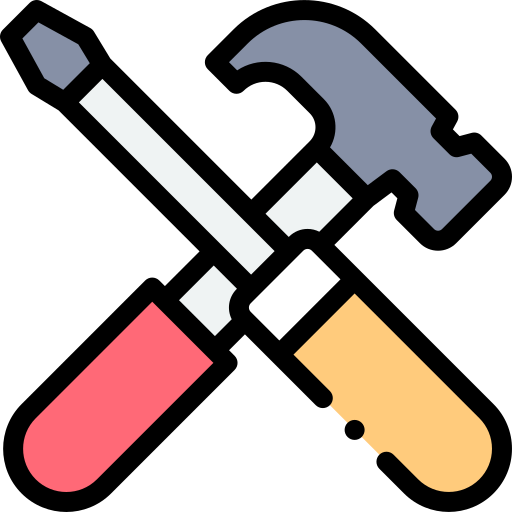

<picture>
  <source media="(prefers-color-scheme: dark) and (max-width: 600px)" srcset="img/header-dark-compact.svg">
  <source media="(max-width: 600px)" srcset="img/header-light-compact.svg">
  <source media="(prefers-color-scheme: dark)" srcset="img/header-dark.svg">
  
</picture>

 **Incoming M.S. @ BUPT** · 2027–2030 
 **B.S. @ Jiangnan University** · 2023–2027

  

##  Research

###  AIGC Detection

[**RA-Det**](https://arxiv.org/abs/2603.01544) 
**Towards Universal Detection of AI-Generated Images via Robustness Asymmetry** 
 &nbsp;·&nbsp; Third author &nbsp;·&nbsp; <a href="https://arxiv.org/abs/2603.01544">Paper ↗</a>

[**WDA-Det**](https://github.com/RainNight11/WDA-Det) 
**Distribution-Aligned AI-Generated Image Detection via Wavelet Denoising** 
 &nbsp;·&nbsp; Second author &nbsp;·&nbsp; <a href="https://github.com/RainNight11/WDA-Det">Code ↗</a>

[**MambaGuard**](https://link.springer.com/chapter/10.1007/978-981-95-5699-1_25) 
**A CLIP-Mamba Approach for OOD Generated Image Detection** 
 &nbsp;·&nbsp; Co-first author &nbsp;·&nbsp; <a href="https://link.springer.com/chapter/10.1007/978-981-95-5699-1_25">Paper ↗</a> &nbsp;·&nbsp; <a href="https://github.com/RainNight11/MambaGuard">Code ↗</a>

###  LLM Safety

[**CIRA**](https://arxiv.org/abs/2609.35002) 
**Still There, No Longer Seen: Exposing Compression-Induced Risk in Large Vision-Language Models** 
 &nbsp;·&nbsp; Under review &nbsp;·&nbsp; Co-first author &nbsp;·&nbsp; <a href="https://arxiv.org/abs/2609.35002">Paper ↗</a> &nbsp;·&nbsp; <a href="https://github.com/RainNight11/CIRA">Code ↗</a>

[**OTS-Bench**](https://arxiv.org/abs/2603.03714) 
**Revealing Order-to-Space Bias in Multimodal Image and Video Generation** 
 &nbsp;·&nbsp; Under review &nbsp;·&nbsp; Co-first author &nbsp;·&nbsp; <a href="https://arxiv.org/abs/2603.03714">Paper ↗</a>

##  Projects

🎙️ [**VoicePrint**](https://github.com/RainNight11/Voice) 
**Voice cloning &amp; speech synthesis from a few seconds of audio.** 
Flutter · Spring Boot · Python · CosyVoice &nbsp;·&nbsp; <a href="https://github.com/RainNight11/Voice">Code ↗</a>

##  Tech & Tools

 &nbsp;  &nbsp;  &nbsp;  &nbsp;  &nbsp;  &nbsp;  &nbsp; 

[More projects on GitHub ↗](https://github.com/orangecc7?tab=repositories)
